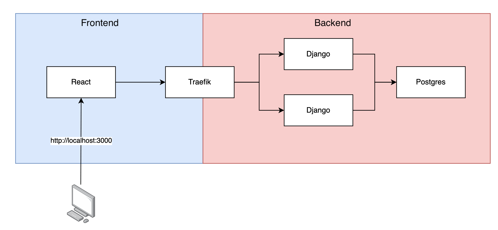
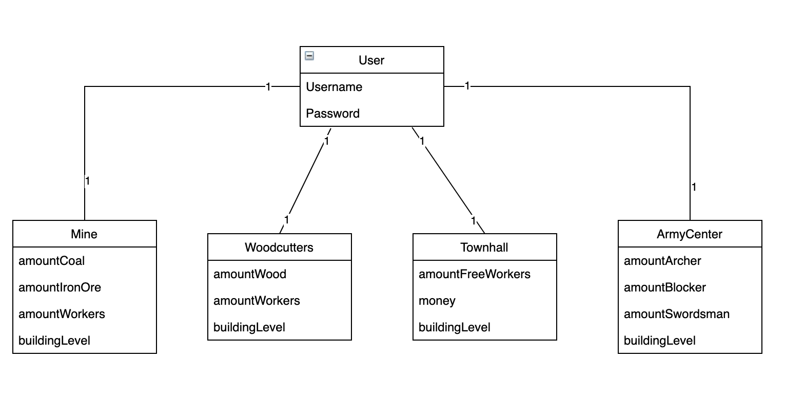

# Arcitecture

## Loadbalancer
As an loadbalancer for the application we decided to use Traefik. We decided to use traefik due to the fact, that it is very well documented and presented in the course. Traefik is designed to be used with virtualisation technologies and is open source.

## Backend
Our goal with this assignment was to learn new technologies. Therefore we decided to use Django. Django is a very powerfull web framework for python. We had some previous experences with python but barely any with Django. We decided, that we whant to implement our REST service with Django.

## Frontend
To write our frontend servce we decided to use React. React is the most popular frontend framewor and provides therefore a lot of great documentaton. React was another new technology to us. We had previous experiences with javascript and npm but we have never used React before this assignment.

## Database
To store the data we use a PostgreSQl database. PostgreSQL is used due to the fact, that we can make great use of a ralational database as shown in the digram below. Our database is generated from our python backend code.



# Dockecompose
## Run docker-compose
Dockercompose can be started with the following command. This command runs and builds the containers. Adding the -d parameter to the command will start the containers in the background (no console log).
```
docker-compose up --build
```


### React
- React listens to port 3000. 
- Port 3000 is exposed.

=> Open [http://localhost:3000](http://localhost:3000)

### Postgres
- Postgres listens to default port 5432. 
- Postgres will create the volume pg_data:/data/postgres to backup the database

### Django
- Listening to port 80 for Docker container
- containerss are only reachable through traefik

### Traefik
Traefik is running as a loadbalancer for the django containers. Traefic is listens to all traffic on port 80 (http).

## Stop docker-compose
```
docker-compose stop
```

## Compleatly cleaning docker
To remove all previously generated containers to start fresh enter:
```
docker system prune --all
```
### Remove volume
to see all volumes:
```
docker volume ls
```
to remove strategy game volume:
```
docker rm postgres
docker volume rm ds1-strategygame_pg_data
```