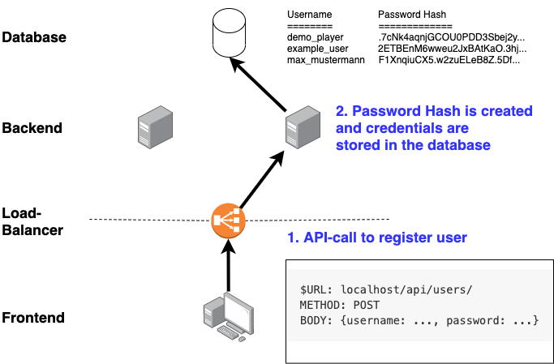
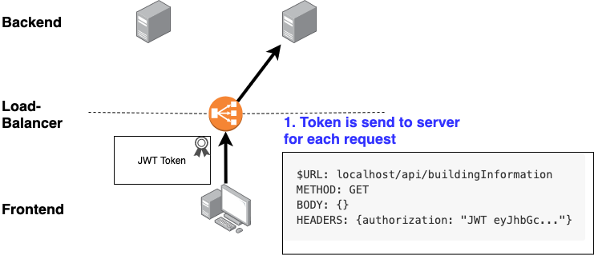

# Strategy Game Frontend (Documentation and Architectural Decision Record)

## Description

Dockerized React-Frontend for the Challenge-Task in "Distributed Systems" @ Fachhochschule OST

## About

This document contains information about the architecture and code of the frontend as well as a list of architectural decisions we made during the development.

## Technology Stack

The frontend uses the following technologies:

- JS/HTML
- React Framework / React Testing Library / React Dom
- Bootstrap
- JWT Token
- normalize.css
- jQuery

## Current Version of NPM Libraries

The Tool `npm-check` was used to validate that all libraries are installed with their newest version.

This screenshot shows `npm-check` before updating the libraries.


The libraries-Version were last checked on Mai 13 2021, 16:00 

## Screenshots / Responsive Layout

Frontend on a large screen:


Frontend on a small / mobile screen:


## Run the Frontend


### Build Docker Image

Create a docker-image for the frontend like this:

```
cd game-frontend/
docker build -t game-frontend:dev .
```

### Run Docker Container

```
docker run -it --rm \
-v ${PWD}:/app \
-v /app/node_modules \
-p 3001:3000 \
-e CHOKIDAR_USEPOLLING=true \
game-frontend:dev
```

=> Open [http://localhost:3001](http://localhost:3001)


### Run frontend on local machine

`npm start`

=> Open [http://localhost:3000](http://localhost:3000)


## Run the tests

To start Test-Runner:

`npm test`

Afterwards, press a to run all the tests


(Auf dem Screenshot ist nur ein Test zu sehen, später wurden weitere dazugefügt)

## User Interface with React

The User Interface is built with several nested React Components:


(Some Components are not shown in this diagram to reduce complexity)


## Login and JWT Tokens

### Create a user

To login for the first time, a user has to be added to the database. 



The user can also be created with Postman:
```
URL: localhost/api/users/
METHOD: POST
BODY: {username: ..., password: ...}
```


If the registration of the new user was successful, a JWT-Token will be created and returned to the client.

Users can login with another API-Call:


If the provided credentials are correct, the token will be returned from the server to the client (frontend) where it will be added to the local storage:


For all the requests where the client has to be authenticated, it will send the token to the server:




## Boostrap

We used boostrap and it's CSS-files to speed up development. The Boostrap-Dependency is added via npm. We also used popper.js to create modal dialogs:

 
 
## Architectural Decisions

### Client-Side Rendering

We decided to use React for our Client-Side rendering, mainly because it allowed us to distribute the work between the team-members easier. That way we had to excactly define our API-Endpoints and how the Backend and the Frontend should Communicate.

### Redundance

Looking at the code in the frontend there seems to be a lot of redundance. We decided not to represent our different types of "buildings" in a generic way (for example we have a database table for each type of building instad of a generic table "building"). For now the functionality for the different types of building is more or less the same which brings some redundance into the code. The reason why we accepted some redundancy instead of introducing a new abstraction layer was because we think it might be possible that each type of building will get more indidivual behaviour if the game was developed further. 

### Common UI-Components

We used a React-"Layout" to define common components that should be visible on more than one page (mainly for the navbar). The alternative would have been to copy-paste the common components to each page where they are needed. We choose the React-Layout to reduce redundancy, accpeting that the code became a little bit mor compex.

### Polling vs. Websockets

The ressources of a user are dependent on the time so we have to refresh the ui every now and then. We could have used Sockets (for example with socket.io) so the server could inform the client about changes. We evaluated socket.io but decided against it because we think it would introduce a lot of complexity into our code especially because we use multiple instances of our service and a load balancer which makes it even harder to maintain an persitant connection between the server and the client (we wanted to have stateless services). Instead we decided that the client (frontend) polls the server every 10 seconds. This solution has the disadvantage that it is not very performant because the server has to do the same calculation over and over again when sometimes there is not even a new result. This solution would also not scale very well if there were many users playing at the same time but it sould work fine for our use-case. Because we use React, the frontend is only repainted if there is a change in the data.

### Bootstrap Grid System vs. CSS Grid

We display the types of buildings in a grid. As we already use Bootstrap we could have used the Boostrap Grid System to display the responsive grid but we decided to use the build-in CSS grid to be too more independant from bootstrap and because we thought that CSS Grid was easier to use for our use-case. 


### CSS Normalize vs. CSS Reset

We decied to use CSS Normalize instead of a CSS Reset because we wanted to have some Pre-Styled Components to speed-up development, accepting that we loose some control about how our components look like in different browsers.

### Mocked Backend

To be able to develop the frontend independant from the backend-services, we created a Mock-Backend for testing and development. This Mock-Backend was then replaced by AJAX-Calls to the "real backend" as soon as the Backend implemented those endpoints.